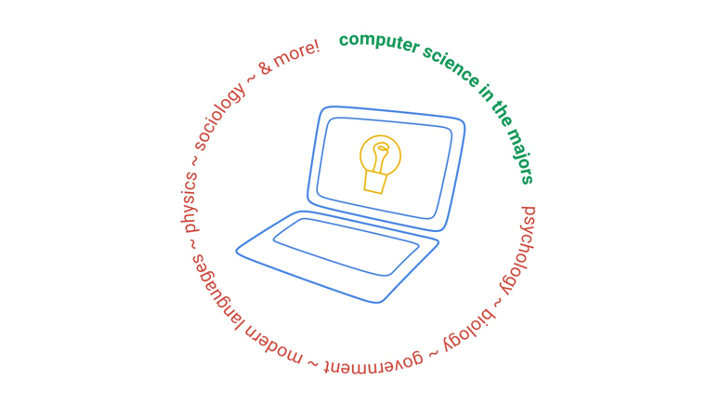

# Computer Science in the Majors
## Created by Developer Student Club at W&M
## Fall 2020

The Developer Student Club at W&M wanted to focus on bringing computer science skills to other majors through a series of hands-on workshops. The descriptions of each workshop with relevant links follow below. 

### [Workshop 1](https://dsc.community.dev/events/details/developer-student-clubs-william-mary-presents-computer-science-in-the-majors-public-policy-international-relations-and-government/): Public Policy, International Relations, & Government
#### Date: November 24, 2020
#### Educator: Clare Heinbaugh
Have you ever wanted to learn about web scraping? At this workshop geared towards Public Policy, IR, and government majors, we will explain how to use Python tools to extract current keywords describing a news topic.

[Here](https://youtu.be/0747M5iBZR8) is the video recording from the workshop.
You can follow along with the code in the [lesson_1](https://github.com/developerstudentclubwm/cs_majors/tree/main/lesson_1) folder. 

### [Workshop 2](https://dsc.community.dev/events/details/developer-student-clubs-william-mary-presents-computer-science-in-the-majors-sociology-history-and-linguistics/): Computer Science in the Majors: Sociology, History, and Linguistics
#### Date: October 15, 2020
#### Educator: Emilio Luz-Ricca
Computer Science can help facilitate text analysis and make processes much quicker. Come to this workshop to learn basic programming techniques from natural language processing to boost your text analysis skills!

[Here](https://youtu.be/61b7A2tmnB4) is the video recording from the workshop.
You can follow along with the code in the [lesson_2](https://github.com/developerstudentclubwm/cs_majors/tree/main/lesson_2) folder. 

### [Workshop 3](https://dsc.community.dev/events/details/developer-student-clubs-william-mary-presents-computer-science-in-the-majors-physics/): Physics
#### Date: November 5, 2020
#### Educator: Archana Radhakrishnan
At this workshop, you will learn how to use Mathematica to model and visualize physical systems. We will also learn to use the popular scientific typesetting system LaTeX to format and display our results. 

[Here](https://youtu.be/677c-E-drZ8) is the video recording from the workshop.
You can follow along with the code in the [lesson_3](https://github.com/developerstudentclubwm/cs_majors/tree/main/lesson_3) folder. 

